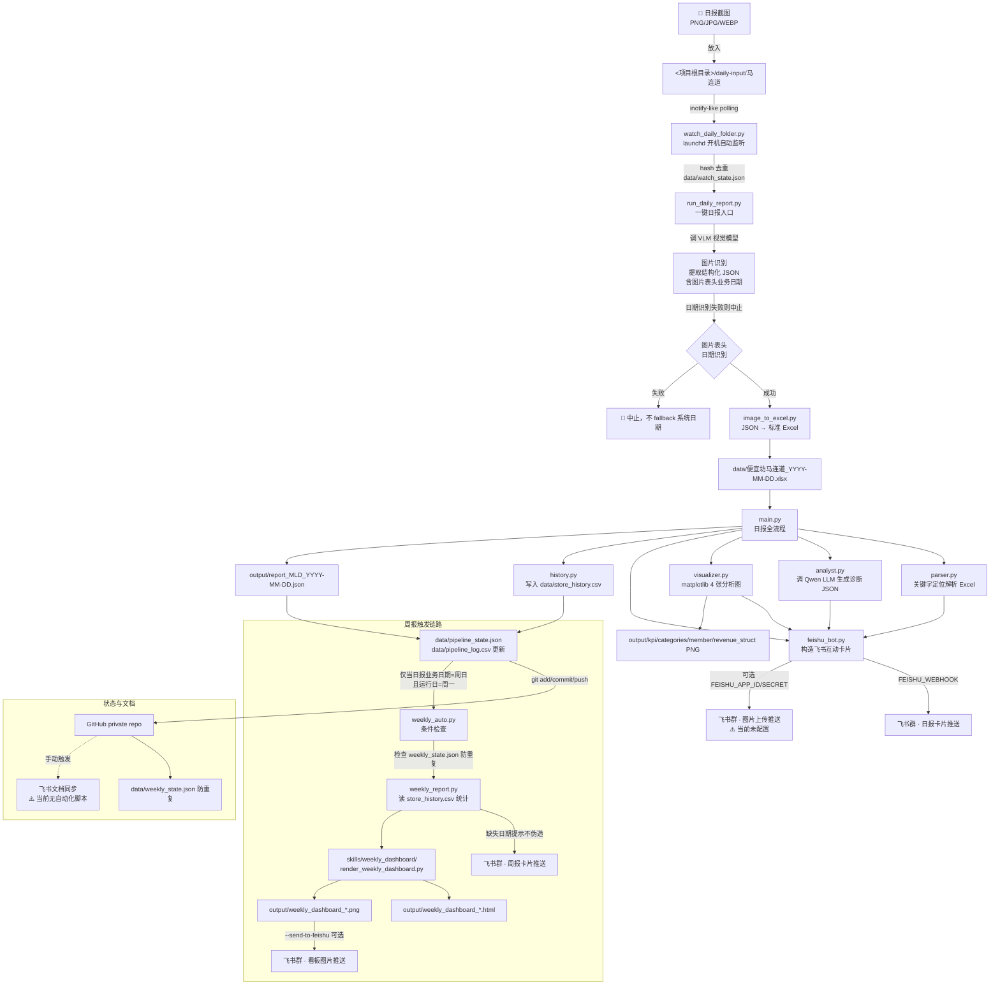
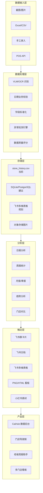

# 餐饮报表数据可视化自动化项目全景图（Mermaid）

> 生成时间：2026-06-01
> 基于仓库真实状态绘制，非规划图。

## 当前数据流全链路



## 产品模块状态全景图

```mermaid
graph LR
    subgraph 已完成 ✅
        A1[截图监听<br/>launchd]
        A2[VLM 图片识别<br/>日期校验]
        A3[Excel 生成]
        A4[日报 AI 诊断<br/>Qwen LLM]
        A5[飞书日报卡片]
        A6[历史数据沉淀<br/>store_history.csv]
        A7[周报自动触发<br/>weekly_auto]
        A8[周报卡片推送]
        A9[weekly_dashboard<br/>ECharts HTML/PNG]
        A10[Git 自动提交]
        A11[数据日期完整性校验]
    end

    subgraph 进行中 🔧
        B1[飞书图片推送<br/>需 App 凭证]
        B2[分析图推送飞书]
        B3[飞书文档自动同步<br/>当前手动]
    end

    subgraph 未来规划 📋
        C1[御炉通明湖<br/>多格式适配]
        C2[飞书多维表格同步]
        C3[异常规则引擎]
        C4[趋势分析图<br/>7日/30日]
        C5[月报/季报]
        C6[多门店支持]
        C7[Web Dashboard]
        C8[CaiHub 产品化]
        C9[小红书素材生成]
        C10[HyperFrames 视频周报]
    end
```

## 推荐未来架构


